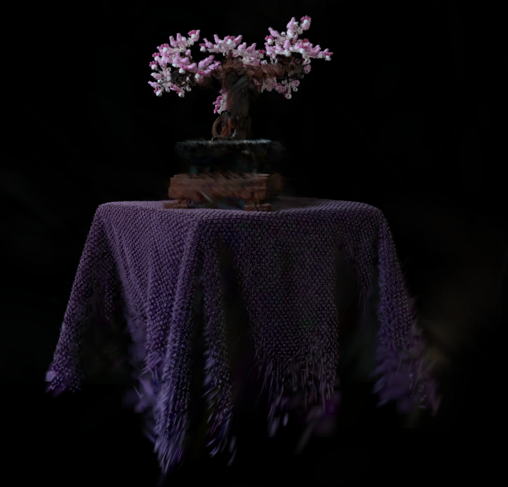
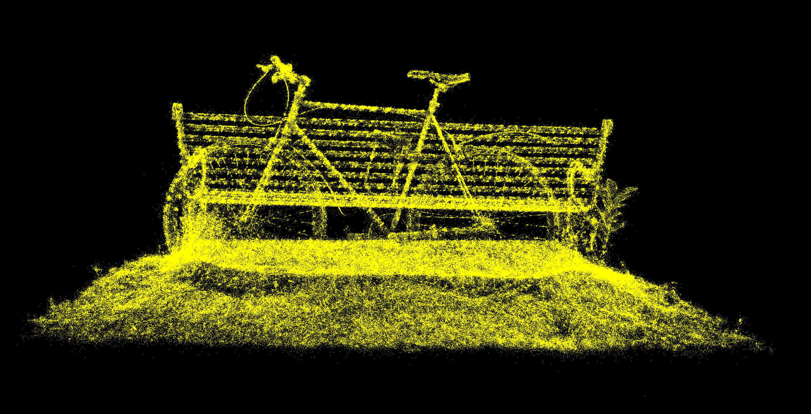
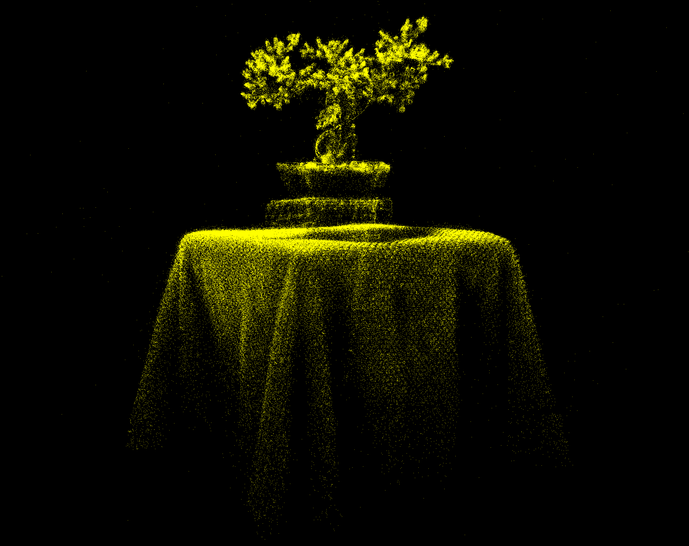
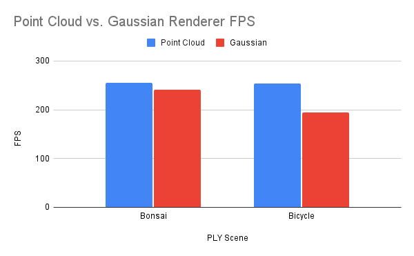
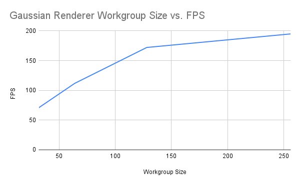

# Project5-WebGPU-Gaussian-Splat-Viewer

**University of Pennsylvania, CIS 565: GPU Programming and Architecture, Project 5**

- Bryce Joseph
- [LinkedIn](https://www.linkedin.com/in/brycejoseph/), [GitHub](https://github.com/brycej217)
- Tested on: Windows 11, Intel(R) CORE(TM) Ultra 9 275HX @ 2.70GHz 32.0GB, NVIDIA GeFORCE RTX 5080 Laptop GPU 16384MB

# CIS 5650 Project 5 - WebGPU Gaussian Splat Renderer

## Live Demo

Click the gif to see a live demo in your browser!

## Gaussian Splatting

This project involved creating a gaussian splatting renderer in WebGPU. Gaussian splatting is a modern real-time rendering technique where a 3D scene is represented not with traditional triangles or voxels, but as a collection of 3D Gaussian primitives. Each gaussian stores a position in space, and a shape defined by a covariance matrix (encoding rotation and scale), as well as color data. More details can be found in the famous [3D Gaussian Splatting
for Real-Time Radiance Field Rendering](https://repo-sam.inria.fr/fungraph/3d-gaussian-splatting/) paper.

This gaussian splat viewer renders gaussians as quads, utilizing a gaussian's position, opacity, rotation and scale to render quads at their proper size and color and opacity data to tune the color and alpha of points within the quad. Utilizing this method, we can produce convincing looking gaussian primitives.

The gaussian renderer renders gaussians with 3 passes, a preprocessing compute shader, a sorting compute shader, and a final rendering pass using the data calculated in the preprocessing stage. The preprocessing stage is responsible for reading incoming gaussian data like position, opacity, rotation and scale, and calculating the proper radius, color, and conic of the final quad. Mathematical details can be found in this post by [
AI 葵](https://github.com/kwea123/gaussian_splatting_notes) and of course in the [3D Gaussian Splatting Paper](https://repo-sam.inria.fr/fungraph/3d-gaussian-splatting/).

After we have the corresponding data for each quad, we determine which gaussians are visible in a radix sort pass. After this, we can render the quads to the screen in a final rendering pass, utilizing color and conic to determine the color and opacity of a fragment within the quad.

### Point Cloud Rendering

In addition to the gaussian renderer, there is a point cloud renderer, which simply renders all points from the PLY data. This essentially visualizes the centers of each gaussian before preprocessing.

## Analysis

Analysis was performed on a bonsai scene consisting of around 272956 points and a bicycle scene consisting of around 1063091 points (389% more than the bonsai scene).

### Point Cloud vs. Gaussian

As seen from the chart above, we notice that the gaussian renderer performs worse than the point cloud renderer, but only by a small margin. We notice that the point cloud renderer has similar a similar fps count between the bonsai and bicycle scene, which makes sense as rendering points to the screen is fast considering there is no preprocessing phase. Still, introducing the preprocessing phase via the guassian renderer, we still see competitve fps with 241.7 and 194.9 fps for the bonsai scene and bicycle scene respectively.

### Workgroup Size

As seen from the chart above, we notice that increasing workgroup size improves fps for the gaussian renderer, by a signficant margin. This makes sense, as the workload is very computation heavy and less bottlenecked by memory access.

### View Frustum Culling

View frustum culling did not lead to any significant performance increase or decrease when the scene was fully visible. However, when approaching the scene, and even getting the camera inside of objects, with view frustum culling disabled, I was getting extremely low fps counts, of around 3 to 4 fps. This is possibly because of some of the 2D covariance matrices representing a larger area of NDC space, which might produce a significant number of fragments. Without frustum culling, this problem can balloon for several points, which might have led to this significant performance decrease.

### Number of Gaussians

Comparing our two scenes, the bonsai scene consisting of around 272956 points and the bicycle scene consisting of around 1063091 points (389% more than the bonsai scene), from the above charts we note that the gaussian renderer performed better on the bonsai scene, being about 124% faster. This again makes sense, as with more points, we need to perform our preprocessing and sorting stage more, which is the main performance bottleneck within the program.

## Credits

- [Vite](https://vitejs.dev/)
- [tweakpane](https://tweakpane.github.io/docs//v3/monitor-bindings/)
- [stats.js](https://github.com/mrdoob/stats.js)
- [wgpu-matrix](https://github.com/greggman/wgpu-matrix)
- Special Thanks to: Shrek Shao (Google WebGPU team) & [Differential Guassian Renderer](https://github.com/graphdeco-inria/diff-gaussian-rasterization)
